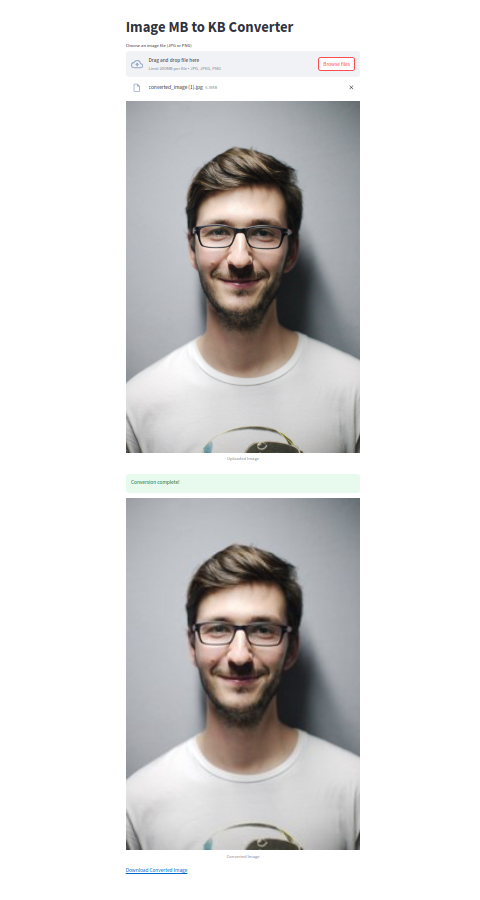

This program is a simple web application built using Flask, a Python web framework, and HTML. Its primary purpose is to provide users with a convenient way to convert the size of images from megabytes (MB) to kilobytes (KB) and then download the converted image. Here's a brief overview of the program's functionality:

User Interface (HTML/CSS):

The web interface is clean and user-friendly, styled using Bootstrap for a responsive design.
Users can upload an image file in JPG or PNG format through a file input form.
The "Convert" button triggers the server-side processing to resize the image and convert it to a target size of 100 KB.
Server-side Processing (Flask and PIL):

The Flask web application handles both GET and POST requests.
When a user uploads an image, the server saves it to a temporary location and invokes the mb_to_kb_converter function.
The mb_to_kb_converter function uses the Python Imaging Library (PIL) to resize the image while maintaining its aspect ratio, ensuring it fits within a 300x300 pixel bounding box.
The function iteratively reduces the image size until its file size is below the target size of 100 KB.
Result Display and Download:

After successful conversion, the original and converted images are displayed on the webpage.
If the conversion is successful, a "Download Converted Image" button becomes visible, allowing the user to download the resized image.
Error Handling:

If an error occurs during the image conversion process (e.g., invalid image format or corrupt file), the program gracefully handles the exception, and the download button remains hidden.
In summary, this program provides a practical solution for users who need to resize images to a specific file size, making it suitable for scenarios where image size constraints are essential, such as web optimization or application requirements. The straightforward interface makes it easy for users to upload, convert, and download their images with minimal effort.

#hugingface link
https://huggingface.co/spaces/razaAhmed/mbtokb